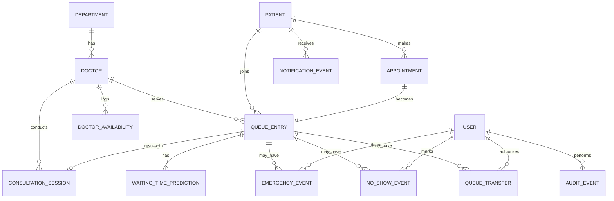
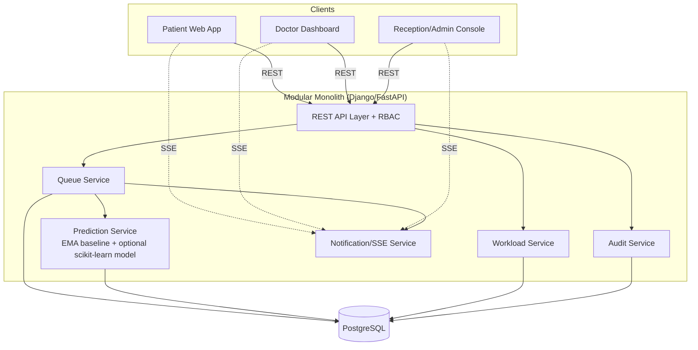

# PS7 — Outpatient Wait-Time & Dynamic Queue Velocity Tracker
## Complete Technical Research & Product Blueprint

*A single source of truth for implementation planning. Research-backed, hackathon-scoped, no code written yet.*

---

## 01. Executive Summary

PS7 asks for one thing at its core: **a queue that tells the truth about how long people will wait, and updates that truth the instant reality changes.** Fixed-slot scheduling (e.g., "9:00, 9:15, 9:30…") fails in outpatient clinics because consultation length is a random variable, not a constant — one patient takes 6 minutes, the next takes 22. Research on hospital queueing confirms this: studies applying queueing theory to real EMR timestamp data show waiting-time estimates improve substantially once they're driven by actual service-time distributions instead of scheduled slot arithmetic<cite index="6-1">using queueing theory allows waiting time to be calculated while minimizing input errors and distortion factors, and outpatient waiting times measurably decreased after digital timestamp data was introduced</cite>. Multiple hospital ML studies confirm that queue length and recent service velocity are the dominant predictive signals, with machine learning outperforming static averages once enough data exists<cite index="4-1">an interpretable framework applying SHAP analysis found that queue length is the single largest driver of outpatient waiting time</cite>.

The recommended product is a **modular monolith web application** (Django/FastAPI or Node/Express backend + React frontend + Postgres) that:

1. Tracks doctors, patients, appointments, and a live **priority queue per doctor**.
2. Measures actual consultation duration via **software timestamps** (Start/Complete button presses) — no hardware assumed.
3. Computes waiting time dynamically as `(current consultation's remaining time) + (sum of predicted durations for everyone ahead)`, re-triggered on every state change.
4. Starts with a **deterministic statistical baseline** (weighted/exponential moving average per doctor) and layers a **lightweight ML regressor** (gradient-boosted trees) on top only once baseline logic is solid — ML augments, never replaces, the deterministic engine.
5. Handles **emergencies, no-shows, doctor unavailability, and multi-doctor workload balancing** as first-class, audited, explainable events.
6. Pushes updates to clients over **Server-Sent Events (SSE)** — the correct-weight tool for a mostly server→client, one-directional update stream, avoiding WebSocket complexity that the problem doesn't need<cite index="8-1">SSE is one-way, meaning the server can push updates to the client, making it simple and efficient for dashboards and notifications, and works over standard HTTP with easier integration than WebSockets</cite>.
7. Uses **synthetic/generated data** (Faker + a custom rule-based simulator, optionally patterned on Synthea-style generators) rather than any real patient data, since none is available or appropriate for a hackathon<cite index="19-1">Synthea is an open-source synthetic patient generator that models patient histories and produces synthetic health data free from cost, privacy, and security restrictions</cite>.

This document is the full blueprint: requirements, architecture, data model, prediction design, UI spec, APIs, security, testing, deployment, and a session-by-session implementation roadmap. **No application code is written here.**

---

## 02. PS7 Requirement Interpretation

Reading the problem statement literally, line by line:

| PS7 line | Literal requirement | Interpretation |
|---|---|---|
| "Fixed appointment schedules often fail…" | Motivates the problem; not a feature request | Justifies replacing fixed slots with a dynamic queue model |
| "continuously estimates patient waiting times based on doctor's current consultation speed" | **Core requirement** | A live, per-doctor service-rate model driving a recalculated ETA |
| "update patients when delays or priority changes occur" | **Core requirement** | Real-time push of updated ETAs, with a visible reason |
| "support emergency handling" | **Core requirement** | Priority insertion workflow with authorization and recalculation |
| "no-shows" | **Core requirement** | Detection/marking, removal from active queue, recalculation |
| "workload balancing between available doctors" | **Core requirement** | Load metric per doctor + assignment recommendation logic |

Everything else (mobile apps, SMS integration, hospital-wide EHR integration, deep learning, video calls, billing) is **not mentioned** and is therefore optional scope, useful only insofar as it strengthens the demo of the five core requirements above.

---

## 03. Problem Analysis

**Why fixed schedules fail:** A schedule assumes deterministic service time. Real consultations vary by patient complexity, doctor pace, documentation overhead, and interruptions. Once one consultation overruns, every subsequent scheduled slot is wrong, and the error compounds — yet the patient never finds out until they ask the receptionist.

**What "dynamic" must mean technically:** the system must treat each doctor as a **service channel with a live, updating rate** (patients/hour or minutes/patient), not a fixed constant. Every event that could change that rate or the queue order — a completed consultation, an inserted emergency, a no-show, a doctor going offline — must trigger **recomputation of every downstream patient's ETA**, and that recomputation must reach the client without a manual refresh.

**Where it maps to Queueing Theory:** this is formally a multi-server queue with **preemptive-resume priority classes** (emergencies), **balking/reneging** (no-shows), and **heterogeneous, time-varying service rates** (each doctor's speed drifts through the day). Classical M/M/c queueing formulas assume exponential, stationary service times — a poor fit here — which is exactly why empirical/ML-driven service-time estimation outperforms pure queueing-theory formulas in practice<cite index="3-1">machine learning models produced better predictions than traditional queueing-theory models in complex real-world scenarios, because queueing-theory-informed feature selection combined with machine learning better captures actual queue dynamics</cite>. We therefore use queueing theory for *structure* (how the queue behaves) and statistics/ML for *the numbers that go into it* (how long things take).

**Core technical challenge:** correctness and consistency under concurrent, rapidly changing state — not raw feature count. A queue that shows a wrong or stale number is worse than one with fewer features.

---

## 04. Required vs Optional Features

### A. Directly required by PS7
- Live queue per doctor with position tracking
- Continuous waiting-time estimation driven by actual consultation speed
- Real-time update push on delay/priority change
- Emergency insertion workflow
- No-show handling
- Multi-doctor workload balancing / recommendation

### B. Strongly recommended engineering features (not explicitly named, but required for the above to work *correctly*)
- Authentication + role-based access (patient/doctor/reception/admin) — otherwise "who can mark emergency" is unanswerable
- Consultation start/end timestamp capture — the only real source of "current consultation speed"
- Audit log for emergency/no-show/reassignment actions — required to make the system trustworthy and explainable
- A statistical fallback estimator that works with zero ML — required by "the system must work even if ML fails"
- Doctor availability state machine — required to make workload balancing meaningful
- Idempotent, race-condition-safe queue mutation (DB transactions/row locks) — required because two events can arrive near-simultaneously (doctor finishes exactly as reception marks a no-show)

### C. Optional enhancements (valuable, not required)
- ML-based duration prediction (vs. moving-average baseline)
- SMS/email/push notifications
- Analytics dashboards / heatmaps for admins
- Patient self-check-in via QR/token kiosk simulation
- Appointment history and rebooking
- Multi-department support beyond a single specialty

### D. Unnecessary scope for this hackathon (explicitly avoid)
- Microservices / Kubernetes / service mesh
- Deep learning / LLMs inside the prediction engine
- Real hospital EHR/HL7-FHIR integration
- Biometric or IoT hardware for consultation detection
- Native mobile apps (a responsive web app covers "patient-facing" needs)
- Payment/billing modules
- Claims of medical diagnosis or regulatory (HIPAA/DPDP) certification

---

## 05. Proposed Product

**Name (working):** *QueueSense* — "Live outpatient queues that tell the truth."

**One-line pitch:** A dynamic outpatient queue system that watches how fast each doctor is actually working right now and tells every waiting patient — in real time — how long they truly have left, while safely handling emergencies, no-shows, and overloaded doctors.

**Product shape:** three connected experiences sharing one backend —
1. **Patient view** — check queue position and live ETA (mobile-first, minimal, no login friction — token/phone based)
2. **Doctor dashboard** — start/complete consultations, see queue, mark emergencies/no-shows, control availability (desktop-first)
3. **Reception/Admin console** — cross-doctor overview, workload balancing recommendations, audit log, system alerts (desktop-first)

---

## 06. User Roles

| Role | Can do | Cannot do |
|---|---|---|
| **Patient** | View own token, position, live ETA, join/cancel queue, receive notifications | See other patients' data, alter queue order, mark emergencies |
| **Doctor** | Start/complete consultations, mark no-show, request emergency insertion, set own availability | Approve their own emergency escalation beyond policy limits, edit other doctors' queues |
| **Reception/Front-desk staff** | Register walk-ins, mark emergencies (with authorization level), mark no-shows, manually reassign patients between doctors, view all queues | Override audit log, delete history |
| **Admin** | Everything reception can do + manage doctors/departments, view analytics, configure policies (grace periods, escalation limits) | — |
| **System (automated)** | Auto-flag suspected no-shows after grace period (flag only, not remove), recompute ETAs, emit notifications | Autonomously reassign patients across doctors without a human confirmation (see §17/§18) |

---

## 07. User Journeys

**Patient journey (happy path):**
`Arrive/register or book ahead → Receive token (e.g., A-42) → Join doctor's queue → View live position & ETA screen → Get notified as position advances → Get notified if ETA changes materially → Called for consultation → Consultation happens → Marked complete → Token closed`

**Patient journey (delay path):**
`Waiting → Doctor's consultation runs long → System recalculates → Patient's screen updates ETA upward with a visible reason ("Current consultations are taking longer than usual") → Optional push notification if delta exceeds threshold`

**Doctor journey:**
`Log in → Set status AVAILABLE → See next patient → Press "Start Consultation" (timestamp recorded) → Consult → Press "Complete" (timestamp recorded, duration computed, rolling average updated) → Next patient auto-surfaces → Optionally: mark emergency insertion mid-queue → Optionally: mark a patient no-show → Go ON_BREAK / UNAVAILABLE when needed`

**Reception/Admin journey:**
`View live cross-doctor board → Notice Dr. A overloaded, Dr. B light → Receive system workload recommendation → Approve reassignment of a waiting (not yet called) patient → Audit log records the action → Affected patients' ETAs recalculate`

**Emergency journey:**
`Reception/doctor flags patient as emergency → Authorization check → Insertion policy applied (not blindly to front) → Affected patients' queue positions and ETAs recalculated → Notification sent explaining why → Event logged with actor, timestamp, reason`

---

## 08. Functional Requirements

**FR1.** The system shall record `consultation_started_at` and `consultation_ended_at` for every consultation and derive `duration_seconds`.

**FR2.** The system shall maintain a per-doctor ordered queue of `QueueEntry` records with a status (`WAITING`, `IN_PROGRESS`, `COMPLETED`, `NO_SHOW`, `CANCELLED`, `TRANSFERRED`).

**FR3.** The system shall compute, for every `WAITING` entry, an estimated wait time using the waiting-time engine (§11) and expose it via API and real-time push.

**FR4.** The system shall recompute all affected estimates within a bounded time (target: < 2 seconds) after any of: consultation start, consultation complete, emergency insertion, no-show marking, doctor availability change, queue transfer.

**FR5.** The system shall allow authorized roles to mark a `QueueEntry` as `EMERGENCY` priority, applying the insertion policy in §15, and shall log the action.

**FR6.** The system shall allow authorized roles (or an automated grace-period flag reviewed by staff) to mark a `QueueEntry` as `NO_SHOW`, removing it from active wait-time calculations.

**FR7.** The system shall compute a workload metric per available doctor and present a **recommendation** for new-patient assignment or manual reassignment; automatic reassignment of already-waiting patients requires human confirmation.

**FR8.** The system shall expose doctor availability states (§17) and reflect their effect on queue membership and ETAs immediately.

**FR9.** The system shall push real-time updates to connected clients (patient, doctor, reception) reflecting any change relevant to them.

**FR10.** The system shall log every priority, no-show, transfer, and availability-change event with actor, timestamp, and reason to an immutable audit trail.

**FR11.** The system shall continue operating on the deterministic baseline estimator if the ML prediction component is unavailable or errors out (graceful degradation).

**FR12.** The system shall generate realistic synthetic demo data (doctors, patients, historical consultations) sufficient to demonstrate all workflows without any real patient data.

---

## 09. Non-Functional Requirements

| Category | Requirement |
|---|---|
| **Reliability** | Queue mutations must be atomic/transactional; no lost or duplicated queue positions under concurrent requests |
| **Consistency** | ETA shown to a patient must never be more than one recalculation cycle stale (~2s) |
| **Performance** | Recalculation for a queue of ~50 patients must complete in well under 500ms server-side |
| **Scalability** | Must handle multiple departments/doctors concurrently (tens, not thousands, for hackathon scope) without redesign |
| **Security** | Role-based access control on every mutating endpoint; no patient can view another patient's data |
| **Privacy** | Minimum necessary operational data only; no diagnosis, no clinical notes, no medical history stored |
| **Explainability** | Every ETA change must be attributable to a stated reason shown in the UI |
| **Availability** | Core queue viewing must degrade gracefully (cached last-known state) if the real-time channel drops |
| **Testability** | Deterministic engine must be unit-testable without any ML dependency |
| **Auditability** | All priority/no-show/transfer/availability actions immutable and timestamped |
| **Accessibility** | WCAG AA contrast, readable type scale, no information conveyed by color alone |

---

## 10. Queue Engine

The queue engine is **deterministic** — no ML inside it. It owns ordering; the prediction engine (§12) only supplies duration estimates it consumes as input.

**Ordering rule (per doctor queue), evaluated top to bottom:**
1. `IN_PROGRESS` entry (if any) is always first — it is being served now.
2. `EMERGENCY` entries next, ordered by emergency-flagged time (FIFO within the emergency class), subject to the insertion policy in §15 (not necessarily position 1 overall).
3. Remaining `WAITING` entries ordered by `queue_sequence` (effectively arrival/check-in order), with any manually-approved priority boosts applied.
4. `NO_SHOW`, `CANCELLED`, `COMPLETED`, `TRANSFERRED` entries excluded from active ordering entirely but retained for history/audit.

**State machine per QueueEntry:**

```text
WAITING → IN_PROGRESS → COMPLETED
WAITING → NO_SHOW
WAITING → CANCELLED
WAITING → TRANSFERRED (moved to a different doctor's WAITING)
WAITING → EMERGENCY (priority flag; still resolves to WAITING/IN_PROGRESS/COMPLETED)
```

**Recalculation trigger events** (each fires a full recompute of that doctor's queue, and only that doctor's queue, for isolation and performance):
`consultation_started`, `consultation_completed`, `emergency_flagged`, `no_show_marked`, `queue_joined`, `queue_cancelled`, `doctor_availability_changed`, `patient_transferred_in`, `patient_transferred_out`.

**Concurrency safety:** every mutation to a doctor's queue happens inside a single database transaction that locks that doctor's queue rows (`SELECT ... FOR UPDATE` or equivalent) so two simultaneous actions (e.g., doctor presses "Complete" while reception marks the same patient's neighbor as no-show) cannot interleave into an inconsistent order. Recalculation is **idempotent** — running it twice with the same inputs produces the same output, so retries after a transient failure are always safe.

---

## 11. Waiting-Time Prediction

### Baseline (Phase 1 — always present)

For each doctor, maintain a **rolling statistic** of recent consultation durations. Two solid, simple choices:

- **Weighted moving average** of the last *N* (e.g., 8–10) completed consultations for that doctor, optionally weighted by recency.
- **Exponential moving average (EMA):** `new_avg = α × last_duration + (1-α) × old_avg`, with α ≈ 0.3. EMA reacts faster to a doctor speeding up or slowing down today than a flat historical average, while remaining simple, explainable, and requiring no training step.

This baseline matters because: (a) it works from day one with zero historical data (seed with a department-level default, e.g., 12 minutes), (b) it is fully explainable to judges and to patients ("based on your doctor's last 8 patients"), (c) it has zero dependency risk — no model to fail, no API to time out, and (d) research on hospital waiting-time prediction confirms queue length and recent service pace are the dominant signal even before any ML is added<cite index="4-1">the length of the queue affects the waiting time the most among the operational features studied</cite>.

### ML option (Phase 2 — additive, optional)

Once enough historical rows exist (recommend a floor of ~150–200 completed consultations across doctors before training), a lightweight tabular regressor can improve on the flat/EMA baseline by learning doctor- and context-specific patterns.

**Candidate features** (operational only — see privacy note below):
`doctor_id`, `department_id`, `hour_of_day`, `day_of_week`, `doctor's own rolling avg (last 5/10)`, `current queue length for that doctor`, `whether the next patient is flagged priority/emergency-adjacent`, `time since doctor's shift start`.

**Target:** `duration_seconds` of the *next* consultation.

**Model choice:** gradient-boosted trees (LightGBM/XGBoost) or even plain scikit-learn `GradientBoostingRegressor`/`RandomForestRegressor`. Hospital wait-time literature repeatedly finds tree ensembles (random forest, gradient boosting) to be strong, robust performers on this kind of small-to-medium tabular operational data<cite index="2-1">across six machine learning methods tested for predicting outpatient wait times, the random forest method provided the best or near-best accuracy for the great majority of clinics studied</cite>. This favors simple, fast, CPU-only, easily explainable tree models over deep learning for a dataset of this size and shape.

**Output contract:** the model returns a single number (`predicted_duration_seconds`) plus, ideally, a simple confidence bound (e.g., ± the residual std-dev from validation) so the UI can show a range instead of false precision.

**Fallback contract (critical, FR11):** the queue/waiting-time engine always calls the model through a wrapper function `predict_duration(doctor_id, context) -> seconds`. If the model is missing, throws, times out, or returns a nonsensical value (e.g., negative, or absurdly large), the wrapper **silently falls back to the EMA baseline** and logs a warning. The rest of the system never knows or cares which source produced the number.

### What NOT to do
- Do **not** put a generative AI/LLM in the numeric prediction path — it is unnecessary, slower, non-deterministic, and harder to justify to judges than a transparent regression. (An LLM *may* have a genuine, clearly-separated, non-core role — see §27.)
- Do **not** use patient medical/clinical features (symptoms, diagnosis, vitals) as model inputs. They are unnecessary for a *time* prediction, introduce privacy risk, and were explicitly warned against in the brief.

---

## 12. ML/AI Strategy

### Technology decision matrix

| Option | What it does | What it does NOT do | API key? | Internet needed? | Train locally? | Infer locally? | Cost | Latency | Complexity | Explainability | Hackathon fit | Privacy |
|---|---|---|---|---|---|---|---|---|---|---|---|---|
| **No-ML statistical baseline (EMA/weighted avg)** | Produces a duration estimate from recent history | Learn nonlinear/multi-feature patterns | No | No | N/A | Yes, instant | Free | ~0ms | Very low | Excellent (a human can recompute it by hand) | Excellent | Excellent |
| **scikit-learn (RandomForest/GradientBoosting)** | Learns duration from tabular operational features | Understand text, images, or clinical meaning | No | No | Yes | Yes | Free | 1–5ms/inference | Low–Medium | Good (feature importances) | **Recommended** | Excellent (operational-only features) |
| **XGBoost/LightGBM** | Same as above, typically higher accuracy on tabular data | Same limits as above | No | No | Yes | Yes | Free | 1–5ms | Medium | Good | Good, if extra setup time is available | Excellent |
| **Hugging Face models (transformers)** | Useful for NLP-style tasks (e.g., classifying free-text intake notes) | Not naturally suited to structured duration regression | No (self-hosted) | Only to download weights | Rarely needed here | Yes | Free (compute cost) | Higher (10s–100s ms) | High for this task | Lower (black-box) | Poor fit for this specific prediction problem | Adds risk if any text fields exist |
| **Cloud ML APIs (e.g., Vertex/SageMaker AutoML)** | Managed training/hosting | Nothing that scikit-learn can't already do here | Yes | Yes | No | No (network call) | Usage-based cost | Network-dependent | Medium (integration) | Medium | Overkill for hackathon scale | Data leaves local environment |
| **Generative AI (Gemini/OpenAI-style LLM)** | Good for natural-language explanations, chat-style Q&A, or summarizing the audit log for staff | Should NOT be the numeric predictor — non-deterministic, expensive, unnecessary for regression | Yes | Yes | No | No | Per-token cost | 200ms–several seconds | Medium (API integration) | Poor for numeric trust | **Optional side feature only**, not core engine | Must not receive patient identifiers |

**Conclusion:** the simplest technology that provides real value is **EMA baseline everywhere, upgraded by scikit-learn/gradient-boosted trees once real usage data accumulates.** No API key, no internet dependency, and no generative AI in the core prediction path. This directly satisfies design principles 3, 6, 7, 8, and 9 in the brief.

### Phased ML progression
- **Phase 1:** rolling/weighted average baseline (ship first, ship reliably).
- **Phase 2:** train an offline scikit-learn regressor on accumulated (synthetic) consultation history; serve it behind the same `predict_duration()` interface, A/B-able against baseline.
- **Phase 3:** online recalibration — periodically (e.g., nightly, or every N new consultations) retrain, or apply a lightweight online update (e.g., adjust the EMA weight or bias-correct the ML residual) so the model tracks a doctor's changing pace without a full retrain pipeline.

---

## 13. Dataset Strategy

**Principle:** collect only operational data needed to run the queue — never clinical/medical data merely because "it's healthcare."

### Core entities and fields (see §25 for full schema)
Patients (name/token/contact — enough to identify a queue position, not a diagnosis), Doctors, Departments, Doctor Availability, Appointments, Queue Entries, Consultation Sessions (timestamps + duration only), Priority/Emergency Events, No-Show Events, Queue Transfers, Waiting-Time Prediction records (for auditability/model evaluation), Notification Events, Audit Events.

**Explicitly excluded:** diagnosis codes, symptoms, prescriptions, lab results, vitals, insurance/billing data, free-text clinical notes. None of these are needed to answer "how long until I'm seen," and each one is a privacy liability with zero benefit to PS7's stated goal.

### Real-data availability
No real hospital data is available or appropriate to use for a hackathon prototype (privacy, consent, and ethics preclude it). This is expected and normal — the brief explicitly calls for realistic *synthetic* data strategy.

---

## 14. Synthetic Data Strategy

**Approach:** a **custom rule-based simulator**, not a raw GAN/deep generative model — the goal is *plausible operational patterns*, not statistical fidelity to a real population, so a simulator is simpler, fully controllable, and instantly explainable to judges.

**Tooling:**
- **Faker** (Python or JS) for realistic-looking but obviously fake patient/doctor names, phone numbers, and tokens<cite index="17-1">Faker is a Python package used to generate synthetic data such as names, addresses, and emails that closely resemble real-world data, for testing and privacy-preserving purposes</cite>.
- A hand-written **simulation script** that generates, per doctor per simulated day: a shift window, a queue of N synthetic patients arriving at realistic intervals, a per-doctor "true" mean/variance consultation time (varied doctor-to-doctor to create realistic heterogeneity), and sampled durations (e.g., from a log-normal distribution, which realistically produces occasional long-tail overruns) with a small number of deliberately injected no-shows and emergencies scattered through the day.
- If richer, standards-shaped synthetic *medical* records were ever wanted (not required here), **Synthea** is the recognized open-source tool for that<cite index="19-1">Synthea models the medical history of synthetic patients and produces synthetic health data free from cost, privacy, and security restrictions</cite> — but PS7 only needs operational timestamps, so a purpose-built simulator is the leaner, better-fit choice, avoiding an unnecessary heavyweight dependency.

**Output:** a seed script that populates the database with historical `ConsultationSession` rows (for the EMA baseline and ML training) plus a "live demo" script that can be re-run during judging to replay a realistic day (arrivals, completions, one emergency, one no-show, one overload) at accelerated speed.

---

## 15. Emergency Handling

**Who can mark a patient emergency:** doctors (for their own current patient context) and reception/admin staff (front-desk triage). Patients cannot self-declare emergency status — the software never independently diagnoses urgency; a human always makes the call, and the UI states this explicitly.

**Priority levels (simple, 3-tier, avoids ambiguity):**
`ROUTINE` (default) → `URGENT` (bumped ahead of routine queue, but behind any in-progress or already-queued URGENT/EMERGENCY) → `EMERGENCY` (bumped to immediately after the current in-progress consultation, i.e., "next," not necessarily literally first if another EMERGENCY is already queued).

**Insertion policy (not "blindly insert at front"):** an EMERGENCY is inserted **after the currently in-progress consultation**, never interrupting a consultation already underway, and **after any earlier-flagged EMERGENCY still waiting** (FIFO within the emergency tier). This avoids indefinite starvation of the routine queue if emergencies keep arriving, and avoids the unsafe pattern of yanking a doctor mid-consultation.

**Authorization & abuse prevention:**
- Every emergency flag requires: `actor_id`, `actor_role`, `reason` (free-text, short), `timestamp`.
- Rate-limit / flag for review: if the same staff account marks an unusually high number of emergencies in a short window relative to department baseline, surface it to an admin audit view (not to block it — clinical judgment must never be blocked by software — but to make abuse visible after the fact).
- Emergencies cannot be self-approved by a patient account (no patient-facing "mark me emergency" control exists at all).

**Recalculation & communication:** flagging an emergency immediately triggers the queue engine (§10) to re-order that doctor's queue and recompute every affected patient's ETA; each affected patient's UI shows the delta and a plain-language reason ("An emergency case was prioritized ahead of you").

**Audit trail:** every emergency event is stored permanently (`EmergencyEvent` table) and visible in the admin audit log — who flagged it, when, why, and which patients were affected.

---

## 16. No-Show Handling

**Definition:** a patient who does not respond/appear when called, within a grace period, after being notified it is their turn (or near their turn).

**Grace period:** configurable, default suggestion 5–10 minutes after being called, or after their predicted turn passes by a threshold with no check-in action.

**Who marks it:** doctor or reception staff, manually, via a "Mark No-Show" action — this keeps a human in the loop for a judgment call that affects someone's care access.

**Automatic detection role:** the system may **auto-suggest/flag** a likely no-show once the grace period elapses (a soft visual flag in the doctor/reception UI: "P103 may be a no-show"), but does **not** automatically remove the patient from the queue without staff confirmation — protects against, e.g., a patient who is in the building but momentarily stepped away.

**Queue effect:** once confirmed, the entry's status becomes `NO_SHOW`, it's removed from active ordering (§10), and all downstream patients' ETAs recalculate immediately (their wait typically **decreases**).

**Notification:** the no-show patient is optionally notified their slot was released (if contactable) and, in policy terms, may be offered re-queuing at the back rather than being fully dropped, depending on clinic policy (configurable).

**Audit trail:** `NoShowEvent` records actor, patient, timestamp, and grace-period metadata.

---

## 17. Doctor Availability

**States:**

```text
AVAILABLE       — actively taking patients
BUSY            — currently in a consultation (derived, not manually set)
ON_BREAK        — temporarily paused, queue holds, ETAs pause/extend accordingly
UNAVAILABLE     — not seeing patients for an extended period (illness, meeting)
OFFLINE         — end of shift; queue closed to new joins
EMERGENCY_ONLY  — only accepting EMERGENCY/URGENT insertions, routine queue paused
```

**Effects on the queue:**
- **Becomes unavailable/on break:** doctor's `WAITING` queue is frozen (no new `IN_PROGRESS`); ETAs recompute using a "resume at" estimate if a return time is provided, otherwise flagged as "delayed — doctor temporarily unavailable" without a false-precision number.
- **Returns to AVAILABLE:** queue resumes; next patient surfaces; ETAs recompute against the resumed rolling average.
- **Overloaded (workload metric exceeds a threshold — §18):** doctor is not force-changed automatically; a **recommendation** is raised to reception/admin to divert new joins to another doctor or open `EMERGENCY_ONLY` handling.
- **Finishes last patient with no more waiting:** state can auto-suggest transitioning toward `AVAILABLE`-idle or `OFFLINE` if end-of-shift, but is confirmed by the doctor, not silently changed.

---

## 18. Workload Balancing

**Load metric per doctor (combines multiple factors, not just headcount):**

```text
load_score(doctor) =
      w1 × waiting_patient_count
    + w2 × sum(predicted_duration_seconds for all waiting patients)
    + w3 × remaining_time_of_current_consultation
    + w4 × (priority_weight_bonus for any EMERGENCY/URGENT waiting)
```

Weights (`w1..w4`) are tunable constants (e.g., start with `w1=1, w2=1/60 (convert to minutes), w3=1/60, w4` a fixed bonus per pending priority case). The key idea: **total predicted minutes of work outstanding**, not raw patient count — 6 fast patients can be a lighter load than 2 slow ones.

**Worked example (matches the brief's illustration):**

```text
Dr A: 6 patients, ~12 min avg service → high total outstanding minutes → HIGH load
Dr B: 2 patients, ~9 min avg service  → low total outstanding minutes  → LOW load
Dr C: 4 patients, ~11 min avg service → medium total outstanding minutes → MEDIUM load
```

**Assignment logic for a *new* patient joining:** if their need is compatible with more than one available, non-`OFFLINE`/`UNAVAILABLE` doctor (same department/specialization), recommend the doctor with the **lowest current load_score** among compatible doctors. This is presented as a **recommendation shown at check-in** (reception can override).

**Reassignment of an *already-waiting* patient:** the system may **suggest** a transfer when one doctor's load is far above another's, but this is always a **recommendation requiring explicit staff confirmation** — never silent automatic reassignment — because clinical specialization/continuity may make a transfer inappropriate even when it looks efficient on paper. This distinction (recommendation vs. authorized action) is enforced at the API level: a `GET /doctors/workload-recommendations` endpoint is read-only; the actual move requires a separate `POST /queue/:id/transfer` call carrying an authorized actor.

---

## 19. Real-Time Architecture

### Comparison of approaches

| Approach | Direction | Fits this problem? |
|---|---|---|
| Polling | Client asks repeatedly | Simple but wasteful and laggy; acceptable only as a fallback |
| Long polling | Client waits, server responds when ready | Better than plain polling, still manual reconnection logic, more server resource overhead than SSE |
| **Server-Sent Events (SSE)** | Server → client only, over plain HTTP | **Best fit** — this system is fundamentally server-pushing state (ETAs, statuses) to many read-mostly clients; SSE gives automatic reconnection and simplicity<cite index="7-1">SSE offers automatic reconnection handling versus WebSockets' manual reconnection handling, at moderate rather than advanced implementation complexity, and is well suited to live feeds and notifications</cite> |
| WebSockets | Bi-directional | Overkill — patients/doctors don't need to stream continuous data *to* the server outside normal REST actions (start/complete/mark), so paying for bidirectional connection complexity buys nothing here<cite index="14-1">WebSockets require managing and scaling many open connections including disconnects and retries, and generally require more implementation and maintenance effort than simpler approaches when true bidirectional streaming isn't needed</cite> |

**Decision: Server-Sent Events**, with **polling as an automatic client-side fallback** if the SSE connection cannot be established (e.g., restrictive network/proxy). This satisfies "reliable real-time" without the operational overhead of a WebSocket connection-scaling story, matching the brief's instruction to avoid unnecessary complexity.

**Event channel design:** one SSE stream per doctor's queue (`GET /stream/doctors/:id/queue`) that the doctor/reception dashboards subscribe to, and one lightweight per-patient stream (`GET /stream/patients/:token`) scoped to just that patient's own entry, so a patient's browser never receives other patients' data even at the transport level.

**Payload shape (example event):**
```json
{
  "event": "queue_updated",
  "reason": "consultation_completed",
  "doctor_id": "D-12",
  "updated_at": "2026-08-29T10:41:03Z",
  "entries": [
    {"token": "A-42", "position": 3, "eta_minutes": 24, "eta_clock": "11:05 AM"}
  ]
}
```

---

## 20. Frontend Architecture

**Stack recommendation:** React (with TypeScript) + a component library (e.g., Tailwind CSS utility classes + a small design system, see §21) + a lightweight data layer (React Query/TanStack Query for REST calls, native `EventSource` for SSE).

**Structure:**
```text
/patient   — mobile-first views (token/ETA screen, queue timeline, history)
/doctor    — desktop-first dashboard (current/next patient, controls, workload)
/admin     — desktop-first console (cross-doctor board, audit log, analytics)
/shared    — component library (QueueCard, WaitTimeCard, PriorityBadge, etc. — §per screen spec)
```

**State management:** server state (queue, predictions) lives in a query cache refreshed by SSE push (invalidate/patch cache entries on incoming events) rather than a heavy global client-state store — this keeps the UI a faithful mirror of server truth rather than a second source of it, avoiding a whole class of "UI says one thing, server says another" bugs.

**Responsive rule:** patient-facing screens are mobile-first (single column, large type, big numbers for ETA); staff-facing dashboards are desktop-first (dense tables, multi-column boards) but must remain usable on a tablet at minimum.

---

## 21. UI/UX Design System

**Design intent:** calm, clinical-trustworthy SaaS — not a generic admin-template CRUD look, and not a flashy consumer app. Think "airline gate display" clarity crossed with modern healthcare product polish.

| Token | Guidance |
|---|---|
| **Color** | Neutral base (soft white/near-white background, dark slate text) + one calm primary accent (blue/teal) for actions + semantic colors: green (on-time/available), amber (delayed/on-break), red (emergency/unavailable) — never color alone, always paired with a label/icon for accessibility |
| **Typography** | One clean sans-serif family; a distinctly large, tabular-numeral weight for the ETA number itself (it's the single most important thing on the patient screen) |
| **Spacing** | Generous whitespace on patient screens (reduces perceived anxiety of waiting); denser, information-rich spacing on staff dashboards |
| **Cards** | `QueueCard`, `WaitTimeCard` etc. as flat, subtly bordered cards, not heavy drop-shadows |
| **Status badges** | Pill-shaped, color+icon+text (e.g., 🟢 Available, 🟡 On Break, 🔴 Emergency) |
| **Charts** | Simple bar/line charts only (workload comparison, historical duration trend) — no 3D/gimmick charts |
| **Motion** | Minimal, purposeful only (a number ticking/counting is fine; nothing that delays perception of a real-time change) — explicitly: never animate in a way that could visually mask or delay the arrival of a real-time update |

**States to define for every data view:** loading (skeleton, not spinner-only), empty ("No patients waiting"), error (retry affordance), success, warning (delay), and a distinct **emergency** visual state (used sparingly, only when truly relevant, to preserve its urgency signal).

---

## 22. Screen-by-Screen Specification

For each screen: Purpose · Role · Main components · Data displayed · API calls · Real-time events · Loading/Empty/Error states · Responsive behavior.

### Patient — Live Wait Screen (the single most important screen)
- **Purpose:** answer "how long until I'm seen, and why" at a glance.
- **Role:** Patient.
- **Components:** `WaitTimeCard` (huge ETA number + clock time), `QueueTimeline`, "Why did this change?" expandable explanation, `NotificationCenter` badge.
- **Data:** token, doctor name, people ahead, ETA minutes + expected clock time, doctor status, last-change reason.
- **API:** `GET /patients/:token/wait-time` (initial load).
- **Real-time:** subscribes to `stream/patients/:token`.
- **States:** loading skeleton on first load; empty state N/A (always has a token once joined); error → shows last-known cached value with a "reconnecting…" banner; warning state when ETA increases by more than a threshold.
- **Responsive:** mobile-first single column, ETA number dominates the viewport.

### Patient — Queue Position/Timeline
- Purpose: visualize how many are ahead and recent movement. Components: `QueueTimeline`. Data: ordered mini-list of anonymized positions ahead (no other patient's identity). API: same wait-time endpoint. Real-time: same stream.

### Patient — Join Queue / Token Creation
- Purpose: register into a doctor's queue. Components: department/doctor picker, confirm button. API: `POST /appointments` or `POST /queue/join`. States: error if doctor `OFFLINE`.

### Patient — Notifications / History
- Purpose: past visits and past notifications. API: `GET /patients/:id/history`.

### Doctor — Dashboard (core screen)
- **Purpose:** run the queue and generate the timestamps the whole system depends on.
- **Components:** `ConsultationTimer` (current patient, running time vs. predicted), "Start"/"Complete" buttons, `QueueCard` list (next patients), `PredictionConfidence` chip, `WorkloadCard` (own load vs. peers), `DoctorAvailabilityControl`, `EmergencyDialog`, `NoShowDialog`.
- **Data:** current patient, next patient, full waiting list, rolling avg duration, predicted next duration, own workload score.
- **API:** `POST /consultations/start`, `POST /consultations/:id/complete`, `POST /queue/:id/priority`, `POST /queue/:id/no-show`, `GET /doctors/:id/workload`.
- **Real-time:** subscribes to `stream/doctors/:id/queue`.
- **States:** empty ("No patients waiting"), loading, error with retry, a distinct look when `IN_PROGRESS` timer exceeds predicted duration (soft amber cue, not alarming).
- **Responsive:** desktop-first, usable on tablet at the bedside/desk.

### Reception/Admin — Live Board
- **Purpose:** cross-doctor oversight and workload action.
- **Components:** department overview grid, per-doctor mini `WorkloadCard`s, `QueueTransferDialog`, `EmergencyDialog`, `NoShowDialog`, `DoctorAvailabilityControl` (for all doctors), `AnalyticsChart`, `NotificationCenter` (system alerts), audit log table.
- **API:** `GET /doctors`, `GET /doctors/:id/workload`, plus all mutation endpoints from §24.
- **Real-time:** subscribes to all doctor streams in its department.
- **States:** empty ("No active queues"), alert banner when any doctor exceeds overload threshold.

### Admin — Audit Log
- Purpose: full transparency/history of priority, no-show, transfer, availability events. API: `GET /audit-events`. Read-only, filterable by actor/date/type.

### Admin — Analytics
- Purpose: aggregate view (average wait by department/doctor/time-of-day, no-show rate, emergency frequency). Uses `AnalyticsChart` components; explicitly historical, not real-time-critical.

---

## 23. UI Component Inventory

| Component | Purpose |
|---|---|
| `QueueCard` | One row/card representing a patient in a queue list |
| `WaitTimeCard` | The large, primary ETA display for a patient |
| `DoctorStatus` | Small badge showing a doctor's current availability state |
| `ConsultationTimer` | Live-running timer for the in-progress consultation, vs. predicted duration |
| `QueueTimeline` | Visual ordered list of who's ahead |
| `PriorityBadge` | Visual tag for URGENT/EMERGENCY entries |
| `WorkloadCard` | Per-doctor load_score visualization |
| `PredictionConfidence` | Small chip showing estimate range/source (baseline vs. ML) |
| `NotificationCenter` | In-app list of recent relevant events |
| `EmergencyDialog` | Confirm + reason capture for flagging emergency |
| `NoShowDialog` | Confirm + reason capture for marking no-show |
| `DoctorAvailabilityControl` | Toggle/select for availability state |
| `QueueTransferDialog` | Confirm UI for moving a patient between doctors |
| `AnalyticsChart` | Simple bar/line chart wrapper for admin analytics |

Every component above maps to a real screen need identified in §22 — none included merely for completeness.

---

## 24. Backend Architecture

**Decision: modular monolith**, not microservices. A hackathon team gains nothing from network-hop overhead and deployment complexity between "services" that all read/write the same queue state — a single well-organized codebase with clear internal module boundaries (Queue Service, Prediction Service, Workload Service, Notification Service) is faster to build, easier to keep consistent (one database, one transaction boundary), and easier to demo/deploy.

```text
Client (React) 
    ↕ REST (CRUD/actions) + SSE (live updates)
API Layer (routing, request validation)
    ↓
Auth/RBAC middleware
    ↓
┌─────────────── Modular Monolith ───────────────┐
│  Queue Service        (ordering, state machine) │
│  Prediction Service   (baseline + optional ML)  │
│  Workload Service     (load scoring, recs)      │
│  Notification Service (event → SSE fan-out)     │
│  Audit Service        (immutable event log)     │
└──────────────────────────────────────────────────┘
    ↓
Database (Postgres)
```

**Recommended concrete stack:** Python (Django + Django REST Framework, or FastAPI) for the backend — mature ORM, easy transactional guarantees, and a natural home for the scikit-learn prediction module in the same process (no network call needed to "call the model"); Postgres as the database; React/TypeScript frontend. (Node/Express + Prisma is an equally valid alternative if the team's strength lies there — the architecture above is stack-agnostic.)

**Cross-cutting concerns:**
- **Validation:** schema validation (e.g., Pydantic/DRF serializers) on every mutating request.
- **Error handling:** consistent error envelope `{error: {code, message}}`; 4xx for client/authorization errors, 5xx for server faults, with the prediction fallback (§11) ensuring a 5xx in the ML path never surfaces to the user.
- **Logging:** structured logs (JSON) for every mutation, correlated with a request ID.
- **Transactions:** every queue mutation wrapped in a DB transaction; row-level locking per doctor's queue.
- **Idempotency:** mutating endpoints accept an `Idempotency-Key` header (or are naturally idempotent, e.g., "mark no-show" on an already-no-show entry is a no-op, not an error) to tolerate client retries from a flaky real-time reconnect.
- **Indexes:** on `queue_entry(doctor_id, status, queue_sequence)`, `consultation_session(doctor_id, started_at)`, `patient(token)`.
- **Background jobs:** a lightweight scheduled job for (a) grace-period no-show flagging, (b) periodic ML retraining (Phase 3), (c) stale-connection cleanup for SSE.

---

## 25. Database Schema

### Entities

| Entity | Purpose | Key fields | Relationships |
|---|---|---|---|
| **Department** | Groups doctors by specialty | `id (PK)`, `name` | 1→N Doctor |
| **Doctor** | A clinician running a queue | `id (PK)`, `department_id (FK)`, `name`, `availability_status` | 1→N QueueEntry, 1→N ConsultationSession, 1→N DoctorAvailabilityLog |
| **DoctorAvailability** | Historical/state log of availability changes | `id (PK)`, `doctor_id (FK)`, `status`, `changed_at`, `changed_by (FK→User)` | N→1 Doctor |
| **Patient** | A person using the queue | `id (PK)`, `token`, `name`, `contact` (minimal) | 1→N Appointment, 1→N QueueEntry |
| **Appointment** | An intent to be seen (booked or walk-in) | `id (PK)`, `patient_id (FK)`, `doctor_id (FK)`, `created_at`, `type` | 1→1 QueueEntry (typically) |
| **QueueEntry** | A patient's live position in a doctor's queue | `id (PK)`, `appointment_id (FK)`, `patient_id (FK)`, `doctor_id (FK)`, `status`, `priority_level`, `queue_sequence`, `joined_at` | N→1 Doctor, N→1 Patient, 1→1 ConsultationSession (once started) |
| **ConsultationSession** | The actual service event | `id (PK)`, `queue_entry_id (FK)`, `doctor_id (FK)`, `started_at`, `ended_at`, `duration_seconds` | 1→1 QueueEntry |
| **WaitingTimePrediction** | Snapshot of an ETA computation (for audit/model evaluation) | `id (PK)`, `queue_entry_id (FK)`, `predicted_at`, `eta_seconds`, `source` (`baseline`\|`ml`), `reason` | N→1 QueueEntry |
| **EmergencyEvent** | Emergency flag record | `id (PK)`, `queue_entry_id (FK)`, `actor_id (FK→User)`, `reason`, `flagged_at` | N→1 QueueEntry |
| **NoShowEvent** | No-show record | `id (PK)`, `queue_entry_id (FK)`, `actor_id (FK→User)`, `marked_at`, `auto_flagged (bool)` | N→1 QueueEntry |
| **QueueTransfer** | Cross-doctor move record | `id (PK)`, `queue_entry_id (FK)`, `from_doctor_id`, `to_doctor_id`, `actor_id (FK→User)`, `reason`, `transferred_at` | N→1 QueueEntry |
| **NotificationEvent** | Sent/queued notification | `id (PK)`, `patient_id (FK)`, `type`, `payload`, `sent_at`, `delivered (bool)` | N→1 Patient |
| **AuditEvent** | Immutable log of all sensitive actions | `id (PK)`, `actor_id (FK→User)`, `action_type`, `entity_type`, `entity_id`, `metadata (JSON)`, `created_at` | Polymorphic reference |
| **User** | Login identity for staff roles (patients may use lightweight token auth instead) | `id (PK)`, `role`, `name`, `credentials` | 1→N AuditEvent (as actor) |

### Conceptual ER Diagram



**Required constraints:** `queue_entry.status` and `priority_level` as constrained enums; `consultation_session.ended_at >= started_at` check constraint; unique constraint on `(doctor_id, queue_sequence)` for active entries; `patient.token` unique; foreign keys `ON DELETE RESTRICT` for audit-linked tables (never silently lose history).

---

## 26. API Specification

Representative endpoint set (full request/response bodies to be detailed at implementation time, referencing this schema):

```text
Auth
POST   /auth/login
POST   /auth/logout

Doctors & Departments
GET    /departments
GET    /doctors?department_id=
GET    /doctors/:id
GET    /doctors/:id/availability
POST   /doctors/:id/availability          (staff only)
GET    /doctors/:id/workload
GET    /doctors/workload-recommendations  (read-only recommendation, staff)

Patients & Queue
POST   /patients                          (register/create token)
POST   /appointments
POST   /queue/join
GET    /queue/:doctor_id                  (full live queue, staff view)
GET    /patients/:token/wait-time         (patient view, own entry only)
POST   /queue/:entry_id/cancel

Consultations
POST   /consultations/start               {queue_entry_id}
POST   /consultations/:id/complete

Priority / No-show / Transfer (all require RBAC + write an AuditEvent)
POST   /queue/:entry_id/priority          {level, reason}
POST   /queue/:entry_id/no-show           {reason}
POST   /queue/:entry_id/transfer          {to_doctor_id, reason}

Real-time
GET    /stream/doctors/:id/queue          (SSE)
GET    /stream/patients/:token            (SSE)

Audit & Analytics
GET    /audit-events?actor=&type=&from=&to=
GET    /analytics/wait-times?department_id=&range=
```

**Auth model:** staff (doctor/reception/admin) use standard session/JWT login with RBAC middleware; patients use a lightweight token-based identity (their queue token itself, possibly plus a short PIN sent at check-in) — no need for full account creation for a hackathon demo, and it minimizes personal data collected.

---

## 27. Security & Privacy

- **RBAC enforced server-side** on every mutating endpoint — never trust a client-side role check alone.
- **Minimum necessary data** (§13): no clinical data collected or stored at all.
- **Patient data isolation:** a patient's token can only ever fetch their own `QueueEntry` — enforced at the query layer, not just the UI.
- **Audit immutability:** `AuditEvent` rows are insert-only; no update/delete path in the API for that table.
- **Transport security:** HTTPS/TLS for all traffic in any deployed environment.
- **Secrets management:** environment variables / secret manager for DB credentials and any API keys; never in source control.
- **Rate limiting:** on auth and on write-heavy endpoints (priority/no-show flags) to blunt abuse.
- **No unauthorized generative AI exposure to identifiers:** if an optional LLM-based feature is added (e.g., turning the audit log into a plain-English daily summary for admins, or a patient-facing FAQ chatbot for "what happens at check-in") it must never receive patient names/contact info — only aggregated/anonymized counts — and this is the *only* legitimate non-core role for generative AI in this system, consistent with design principle 6.
- **Claims discipline (do not overstate):**
  - Do **not** claim the system performs medical diagnosis or triage in any clinical sense — it only reorders a queue based on human-authorized priority flags.
  - Do **not** claim HIPAA/DPDP/any regulatory compliance certification — a hackathon prototype has not undergone the audits that "compliance" implies; it is fair to say it was **designed with data-minimization and RBAC principles in mind**.
  - Do **not** claim the ML prediction is more accurate than it has been actually validated to be in the demo dataset.

---

## 28. External APIs & Services

**Directly required:** none. The entire core loop (queue, prediction, emergency, no-show, workload, real-time updates) can run fully self-contained with a database and the application server.

**Optionally valuable, clearly separated as non-core:**
| Service | Use | Required? |
|---|---|---|
| Email/SMS provider (e.g., Twilio, SendGrid) | Patient notifications when not actively viewing the app | Optional — in-app + SSE notification already satisfies "update patients" |
| Push notification service | Same, for a PWA/mobile-like experience | Optional |
| Generative AI API (e.g., an LLM) | Plain-language daily summaries for admin, or a simple FAQ assistant | Optional, non-core, must follow §27 privacy rule |
| Maps/geocoding | Not applicable — no location routing need in PS7 | Not applicable |

**Guiding rule:** every external API is a new failure mode and a new dependency the demo can trip over; add one only if it visibly strengthens the story judges see, and always keep the core queue/ETA loop functioning with zero external services.

---

## 29. Notifications

**In-app (via SSE), primary channel:** every relevant state change appears live on the patient's/doctor's/admin's screen without needing a separate "notification system" — this is the most reliable channel for a demo (no external service to fail).

**NotificationEvent log (optional layer on top):** persist a lightweight record of "notification-worthy" moments (ETA changed by more than threshold, emergency inserted ahead of you, your turn is next, marked no-show) so the `NotificationCenter` component has a history to show, independent of whether the user was actively looking at the screen at that moment.

**Threshold-based triggering (avoid notification fatigue):** only surface a distinct "your wait changed" notification when the ETA delta exceeds a meaningful threshold (e.g., ±5 minutes), not on every single recalculation — otherwise the patient screen would flicker/ping constantly as tiny recalculations happen.

**Optional external delivery (SMS/email/push):** valuable for "step away from the waiting room" use cases, but explicitly optional per §28.

---

## 30. Analytics

Aggregate, historical, non-real-time-critical views for admin:

- Average/median wait time by department, doctor, hour-of-day, day-of-week.
- No-show rate over time.
- Emergency-flag frequency (and by which actor, to support the abuse-visibility goal in §15).
- Doctor utilization (busy time vs. shift length) and workload distribution across doctors.
- Prediction accuracy tracking: compare `WaitingTimePrediction.eta_seconds` against actual realized `duration_seconds`/wait — this is also how you'd judge whether Phase 2 ML is actually beating the Phase 1 baseline, empirically, on your own demo data.

---

## 31. Testing Strategy

| Layer | What to test | Example |
|---|---|---|
| **Unit — Queue Engine** | Ordering logic, state transitions, in isolation, with no DB/ML | "Given 3 waiting + 1 emergency flagged, ordering places emergency after in-progress, before routine" |
| **Unit — Prediction wrapper** | Fallback behavior | "If ML predictor raises an exception, `predict_duration()` returns the EMA baseline value, not an error" |
| **Unit — Workload scoring** | Load metric arithmetic | Matches the worked example in §18 given fixed inputs |
| **Integration** | API endpoints against a real (test) DB | Marking no-show removes entry from `GET /queue/:doctor_id` active list and recalculates downstream ETAs |
| **Concurrency** | Race conditions | Two simultaneous requests to complete the same consultation → only one transition succeeds, the other gets a clean idempotent response, not a corrupted queue |
| **End-to-end (E2E)** | Full user journeys via UI automation | Patient joins → sees ETA → doctor completes ahead of them → patient's ETA visibly decreases in the browser without a manual refresh |
| **Load (lightweight)** | Recalculation performance under realistic queue sizes (tens of concurrent entries) | Recompute completes under target latency (§9) |
| **Security** | RBAC boundary tests | Patient token A cannot fetch patient token B's wait-time; non-staff cannot call priority/no-show endpoints |

**Acceptance criteria (traced to FRs):** see §"Acceptance Criteria" appendix at the end of this document — each is written to be objectively checkable.

---

## 32. Performance & Reliability

- Target recomputation latency: **< 500ms server-side, < 2s end-to-end to client** for a queue of realistic hackathon-demo size (tens of patients).
- Database indexes as specified in §24/§25 to keep queue reads/writes O(log n) rather than full-table scans as data grows.
- SSE connections should include heartbeat/keep-alive pings so clients can detect a dead connection and fall back to polling (§19) rather than silently showing stale data forever.
- All queue-mutating operations are transactional (§10/§24) to guarantee reliability under concurrent staff actions.

---

## 33. Failure Handling

| Failure | Handling |
|---|---|
| ML prediction service errors/times out | Wrapper falls back to EMA baseline (§11); logged, never surfaced as a user-facing error |
| SSE connection drops | Client auto-reconnects (native `EventSource` behavior) and/or falls back to short-interval polling; UI shows a subtle "reconnecting" indicator, never a blank/broken screen |
| Concurrent conflicting queue mutation | DB transaction + row lock ensures only one wins; the loser's client re-syncs from the next broadcast state, not from a stale local mutation |
| Doctor forgets to press "Complete" | Reception can manually correct via an admin override endpoint (logged as a manual correction in the audit trail) |
| Database briefly unavailable | API returns a clear 503 with retry-after; client shows last-known cached state rather than crashing |

---

## 34. Deployment

**Hackathon-appropriate target:** a single deployable web app + managed Postgres — e.g., backend + frontend on a platform like Render/Railway/Fly.io (or a single VM/container), Postgres as a managed instance (or the same platform's managed DB add-on). No Kubernetes, no multi-region, no service mesh — matches design principle 18.

**Containerization (optional but recommended for reproducibility):** a single `Dockerfile` per service (backend, frontend) + `docker-compose.yml` for local dev (app + Postgres), which also doubles as the most reliable way to guarantee "it works on the judges' machine too."

**Environment separation:** `.env`-driven config for local/dev vs. demo-deployed, with the synthetic data seed script re-runnable to reset to a clean demo state before judging.

---

## 35. Monitoring & Observability

- Structured request/error logs (as in §24) — sufficient for a hackathon; no need for a full observability stack.
- A simple `/health` endpoint checking DB connectivity, usable both by the deployment platform and as a manual "is it alive" check right before demoing.
- Basic in-app "System Alerts" panel (admin dashboard) surfacing operational conditions the audience should notice live: a doctor overloaded, ML fallback engaged, an SSE client that dropped and reconnected — this doubles as an observability feature *and* a demo talking point.

---

## 36. Demo Mode

- A **seeded synthetic dataset** (§14) loaded at deploy/reset time so the demo always starts from a known, realistic state (a few doctors mid-shift, a few patients already queued with varied predicted waits).
- A **"scripted incident" trigger** (an admin-only button or CLI script) that fires a pre-written emergency and a pre-written no-show at controllable moments during the live demo, so the presenter can reliably show these workflows without waiting for organic timing.
- A **time-acceleration option** for showing a full day's queue evolution in a couple of minutes if desired (multiplies the simulated clock, not real user-facing behavior).
- A **reset endpoint/script** to restore demo data between judging rounds.

---

## 37. Hackathon Demo Story

Suggested judge-facing narrative arc (5–7 minutes):

1. **Hook (30s):** "Ask anyone who's waited at a clinic — the printed appointment time is a guess. We built a queue that tells the truth, live."
2. **Show the patient screen** with a real ETA, then **complete a consultation** on the doctor dashboard live and show the patient's number visibly update within ~2 seconds — this single moment is the strongest proof of "dynamic."
3. **Trigger an emergency** from reception and show the patient's ETA update with the plain-language reason — proves explainability and safe insertion policy.
4. **Trigger a no-show** and show downstream ETAs *improve* — proves the system handles disruption both ways.
5. **Show the admin workload board** with one doctor clearly overloaded and the system's recommendation — proves the multi-doctor balancing requirement.
6. **Close on the architecture slide:** baseline-first, ML-optional, fails-safe, minimal data collected, real-time via SSE — proves engineering maturity, not just a feature list.

---

## 38. Feature Prioritization

| Priority | Feature |
|---|---|
| **P0 (must work for the demo to make sense)** | Queue engine, EMA baseline prediction, waiting-time engine, consultation start/complete timestamps, real-time push, emergency insertion, no-show handling, workload metric + recommendation |
| **P1 (strongly strengthens the demo)** | RBAC/auth, audit log, doctor availability states, admin analytics, synthetic data + demo-mode scripting |
| **P2 (nice, time-permitting)** | ML prediction layer (Phase 2), notification threshold logic, appointment history for patients |
| **P3 (cut without regret if time-constrained)** | SMS/email delivery, generative-AI summary feature, multi-department analytics polish, online recalibration (Phase 3) |

---

## 39. Technology Decision Matrix

| Decision | Options considered | Chosen | Why |
|---|---|---|---|
| Backend | Django/DRF, FastAPI, Node/Express | **Django/DRF or FastAPI (Python)** | Same-language ML integration (no network hop to call scikit-learn), mature ORM/transactions |
| Database | Postgres, MySQL, SQLite, MongoDB | **Postgres** | Strong transactional guarantees for concurrent queue mutation, relational fit for this data model |
| Real-time | Polling, Long-polling, WebSockets, SSE | **SSE** | One-directional server→client fits the problem exactly; simpler and auto-reconnecting vs. WebSockets<cite index="7-1">SSE offers automatic reconnection handling at moderate complexity, versus manual reconnection handling at advanced complexity for WebSockets</cite> |
| Architecture | Microservices, Modular monolith | **Modular monolith** | One transaction boundary, no unnecessary network hops for a system this size |
| Prediction (Phase 1) | EMA/weighted avg, ARIMA/time-series, ML from day one | **EMA/weighted avg** | Works with zero data, fully explainable, zero dependency risk |
| Prediction (Phase 2) | scikit-learn trees, XGBoost/LightGBM, deep learning, LLM | **scikit-learn / gradient-boosted trees** | Best fit for small-medium tabular operational data; explainable; matches literature on hospital wait-time ML<cite index="2-1">random forest provided the best or near-best predictive accuracy across the majority of clinics evaluated for outpatient wait-time prediction</cite> |
| Frontend | React, Vue, plain HTML/JS | **React + TypeScript** | Component reuse across three role-based UIs, strong ecosystem for real-time data hooks |
| Synthetic data | Faker only, Synthea, custom simulator | **Faker + custom rule-based simulator** | Right-sized: operational timestamps needed, not full clinical record realism |

---

## 40. Implementation Roadmap

### Phase 0 — Research & Architecture
No production code. **Deliverable:** this document, finalized and agreed. **Acceptance:** team can explain every data flow without opening a code editor.

### Phase 1 — Core Database/Authentication
Build foundation: schema migrations for Department/Doctor/Patient/User/QueueEntry; RBAC login. **Files:** `models/`, `migrations/`, `auth/`. **Acceptance:** can create a doctor and a patient via API and log in as each role. **Tests:** model constraint tests, auth RBAC tests. **Do not touch yet:** prediction, workload, real-time.

### Phase 2 — Basic Queue
Join queue, view ordered queue, cancel. Deterministic FIFO ordering only (no priority/ML yet). **Files:** `queue_service/`. **Acceptance:** multiple patients can join a doctor's queue and see correct FIFO order. **Tests:** ordering unit tests.

### Phase 3 — Consultation Tracking
Start/Complete endpoints, `ConsultationSession` writes, rolling-average computation begins accumulating. **Acceptance:** completing a consultation produces a correct `duration_seconds` and updates the doctor's rolling average. **Tests:** duration arithmetic tests.

### Phase 4 — Dynamic Waiting-Time Engine
Implement the baseline waiting-time calculation (§11 baseline, §"Waiting-Time Engine" arithmetic) wired to real queue state. **Acceptance:** the worked example in §11 reproduces correctly against seeded data. **Tests:** engine unit tests with fixed fixtures.

### Phase 5 — Emergency/No-Show
Implement priority insertion policy (§15) and no-show workflow (§16), with `AuditEvent` writes. **Acceptance:** the emergency/no-show examples in §15/§16 reproduce correctly; audit log records both. **Tests:** insertion-policy unit tests, abuse-flag test.

### Phase 6 — Multi-Doctor Workload Balancing
Implement load_score (§18) and the read-only recommendation endpoint; implement authorized transfer endpoint separately. **Acceptance:** worked example in §18 reproduces; transfer requires explicit confirmation call, never happens implicitly. **Tests:** load-score arithmetic tests, transfer authorization tests.

### Phase 7 — ML Prediction (optional/Phase 2 of §12)
Train offline scikit-learn model on seeded historical data; wire behind `predict_duration()` with fallback. **Acceptance:** disabling/breaking the model does not break the queue (fallback test passes). **Tests:** fallback-on-failure test, basic accuracy sanity check against baseline on held-out synthetic data. **Do not touch yet:** frontend polish.

### Phase 8 — Real-Time Updates
Implement SSE streams and client subscription; wire every mutation from Phases 2–7 to emit the appropriate event. **Acceptance:** completing a consultation updates a *second, separately open* patient browser tab within 2 seconds with no manual refresh. **Tests:** E2E real-time test.

### Phase 9 — Frontend Polish
Apply design system (§21), build all screens (§22) and components (§23). **Acceptance:** all three role UIs match the screen specs; accessibility pass (contrast, labels). 

### Phase 10 — Testing
Run the full suite from §31 including concurrency and security tests. **Acceptance:** all acceptance criteria (below) pass.

### Phase 11 — Deployment
Containerize, deploy per §34, run the seed script in the deployed environment, verify `/health`. **Acceptance:** a fresh browser, no prior state, can complete the full demo story (§37) against the deployed URL.

### Phase 12 — Judge Demonstration
Prepare the narrative (§37), rehearse the scripted-incident demo mode (§36), prepare fallback (offline/local) demo in case of venue Wi-Fi issues.

**For every phase:** deliverables, dependencies, likely files/modules, acceptance criteria, and tests are as stated above; nothing in an earlier phase should be re-architected once a later phase depends on it — if a change is needed, it's called out explicitly rather than silently reworked.

---

## 41. Risks & Mitigations

| Risk | Mitigation |
|---|---|
| ML component becomes a demo-day single point of failure | Fallback-to-baseline architecture (§11) makes ML strictly optional at runtime |
| Real-time channel fails on unfamiliar venue Wi-Fi | Polling fallback (§19) + a fully local/offline demo environment as backup (§34/§37) |
| Team over-builds optional features and runs out of time for core requirements | Strict P0/P1/P2/P3 prioritization (§38); Phase 0–8 in the roadmap cover only P0/P1 |
| Judges question data realism | Demo-mode scripted incidents + clear synthetic-data disclosure (§14/§36) — framed as a strength (privacy-safe), not hidden |
| Concurrency bugs under live demo double-clicking | Idempotent mutation design + transactional locking (§10/§24), tested explicitly (§31) |
| Overclaiming (compliance, diagnosis, accuracy) undermines credibility with technical judges | Explicit claims discipline (§27) |

---

## 42. Future Scope

(Explicitly out of hackathon scope, listed only to show architectural room-to-grow — not to be built now.)

- Multi-clinic/multi-branch support with cross-location load balancing.
- True EHR/FHIR integration for a production deployment.
- Deeper ML: sequence models incorporating time-of-day seasonality more richly, per-doctor personalization with more training data.
- SMS/push delivery via Twilio-class providers.
- Kiosk/QR-based physical check-in hardware integration.
- A well-scoped, privacy-reviewed generative-AI assistant for staff-facing summarization only.

---

## 43. Final Recommended Architecture



**Summary of the recommendation:** a single Python (or Node) modular monolith, Postgres for consistent transactional queue state, a deterministic EMA baseline as the always-available prediction source with an optional scikit-learn regressor layered on top behind a safe fallback wrapper, Server-Sent Events for real-time client updates, strict RBAC and audit logging around every priority/no-show/transfer action, and a Faker-plus-custom-simulator synthetic dataset — all chosen specifically because they are the *simplest technology that provides real value* for exactly the five requirements PS7 states, no more and no less.

---

## Research Sources

- Chen et al., "A Parallel Patient Treatment Time Prediction Algorithm and its Applications in Hospital Queuing-Recommendation in a Big Data Environment" — arXiv:1811.03412
- "Predicting Patient Wait Times by Using Highly Deidentified Data in Mental Health Care: Enhanced Machine Learning Approach" — PMC9399879
- "Predicting Waiting Times for Medical Tasks in a Pediatric Hospital Using Machine Learning" — PMC12481172
- "Dissatisfaction-considered waiting time prediction for outpatients with interpretable machine learning" — PMC11461612
- "Analysis of outpatient waiting time using queueing theory and EMR data" — PMC5334129
- DEV Community / IBM Community / Substack comparisons of SSE vs. WebSockets vs. Polling (2025)
- Synthea — MITRE open-source synthetic patient generator (synthetichealth.github.io/synthea, GitHub)
- Faker (Python) documentation and tutorials for synthetic operational data generation
- "Awesome Synthetic Data" curated tool list (GitHub: statice/awesome-synthetic-data)

---

## Appendix — Acceptance Criteria (Traceable)

- **Dynamic prediction:** Given ≥3 historical consultation durations for a doctor, `GET /doctors/:id/workload` and the waiting-time engine return an estimate derived from that history (not a hardcoded constant).
- **Queue:** When `POST /consultations/:id/complete` succeeds, every `WAITING` entry for that doctor shows a recalculated `eta_seconds` within one recompute cycle.
- **Emergency:** When `POST /queue/:entry_id/priority {level: EMERGENCY}` succeeds from an authorized role, the entry is repositioned per the insertion policy (§15), affected patients' ETAs update, and an `EmergencyEvent` + `AuditEvent` row is created.
- **No-show:** When `POST /queue/:entry_id/no-show` succeeds, the entry's status becomes `NO_SHOW`, it is excluded from `GET /queue/:doctor_id` active ordering, and downstream ETAs recalculate (typically decreasing).
- **Workload:** With ≥2 available, compatible doctors, `GET /doctors/workload-recommendations` returns the lower-`load_score` doctor as the suggested assignment for a new patient.
- **ML failure:** With the ML model deliberately disabled/broken in a test, the waiting-time engine still returns a valid, non-null estimate sourced from the baseline, and no 5xx error reaches the client.
- **Real-time:** A change made in one authenticated session (e.g., doctor dashboard) is visible in a second, independent session (e.g., patient view) without a manual page refresh, within the target latency (§9/§32).
- **Security:** A patient token cannot retrieve another patient's `wait-time` data (verified by an integration test asserting a 403/404, not the data).

---

## Implementation Checkpoints (Independent Future Sessions)

Use this section to scope each future coding session narrowly — a coding agent or developer should reference **only** the relevant section(s) of this blueprint per session, and should not touch files outside that session's stated scope.

| Session | Scope | Blueprint sections to reference | Files/modules likely affected | Must remain untouched | Tests required before moving on |
|---|---|---|---|---|---|
| **1** | Architecture + project setup (repo scaffold, Docker, CI skeleton) | §24, §34 | root config, `Dockerfile`, `docker-compose.yml` | — | Project boots locally with `docker-compose up` |
| **2** | Database + authentication | §06, §24, §25 | `models/`, `migrations/`, `auth/` | queue logic (doesn't exist yet) | Model + RBAC unit tests |
| **3** | Core queue engine | §10, §26 | `queue_service/` | auth internals | Ordering unit tests |
| **4** | Consultation tracking | §"Consultation-Duration Measurement" concept in §07/§11, §25 | `consultations/` | queue ordering logic | Duration computation tests |
| **5** | Emergency + no-show | §15, §16 | `queue_service/priority.py`, `queue_service/no_show.py`, `audit/` | consultation tracking internals | Insertion-policy + no-show tests |
| **6** | Multi-doctor workload balancing | §18, §26 | `workload_service/` | emergency/no-show logic | Load-score + transfer-authorization tests |
| **7** | Prediction baseline | §11 (baseline), §12 | `prediction_service/baseline.py` | ML module (not built yet) | Baseline arithmetic tests |
| **8** | ML model | §11 (ML), §12, §39 | `prediction_service/ml_model.py`, `ml/train.py` | baseline module (must remain the fallback) | Fallback-on-failure test |
| **9** | Real-time events | §19 | `notification_service/`, SSE endpoints | REST endpoints (extend, don't rewrite) | E2E real-time propagation test |
| **10** | Patient UI | §20–§23 (patient screens) | `frontend/patient/` | doctor/admin UI (build separately) | Screen renders all defined states |
| **11** | Doctor UI | §20–§23 (doctor screens) | `frontend/doctor/` | patient UI | Same |
| **12** | Admin UI | §20–§23 (admin screens) | `frontend/admin/` | patient/doctor UI | Same |
| **13** | Notifications | §29 | `notification_service/thresholds.py`, `NotificationCenter` component | core SSE transport (extend, don't rewrite) | Threshold-triggering tests |
| **14** | Testing | §31–§32 | `tests/` (all layers) | application code (fix bugs found, don't add features) | Full suite green |
| **15** | Deployment | §34–§35 | deployment configs, `/health` endpoint | application logic | Deployed `/health` returns OK; seed script runs |
| **16** | Final polish + demo | §36–§37 | demo-mode scripts, minor UI polish | core architecture (frozen by this point) | Full demo story (§37) runs end-to-end without manual intervention |

**Guiding rule for every session:** read only the referenced sections above before starting; if a session's work seems to require changing something outside its listed files, stop and treat that as a signal the blueprint needs a deliberate, explicit update — not a silent scope drift.
