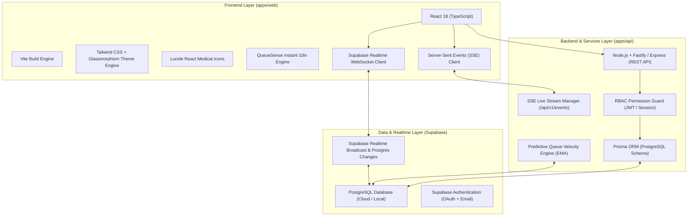
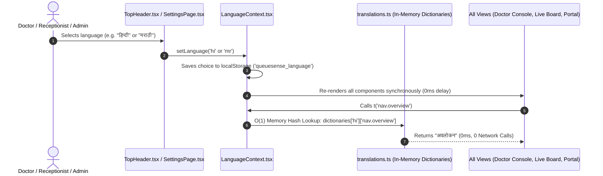

# QueueSense — Technology Stack & Localization Architecture

Comprehensive technical documentation of the full-stack architecture, frontend/backend engineering, database synchronization, and the zero-latency multi-language localization engine powering **QueueSense — Hospital Operations OS**.

---

## 1. Full-Stack Technology Architecture



---

## 2. Technology Stack Breakdown

### **A. Frontend Layer (`apps/web`)**
| Technology | Role & Purpose in QueueSense |
|---|---|
| **React 18** | Component-driven declarative UI with hooks for stateful queue and consultation management. |
| **TypeScript** | Strict type safety for data models (`AppPatient`, `DoctorMeta`, `UserRole`, `NavSection`, `PriorityLevel`). |
| **Vite** | Blazing-fast development environment (sub-50ms HMR) and tree-shaken production bundler. |
| **Tailwind CSS & Vanilla CSS** | Modern clinical design system featuring Glassmorphism, ambient light mode, high-contrast dark clinical theme, and responsive breakpoints. |
| **Lucide React** | Medical, triage, and operational vector icons. |
| **HTML5 WebSockets & SSE** | Dual-channel real-time connection for sub-second ETA updates and live board state mutations. |

---

### **B. Backend & Microservices Layer (`apps/api`)**
| Technology | Role & Purpose in QueueSense |
|---|---|
| **Node.js & Fastify / Express** | High-performance asynchronous REST API handling patient registrations, triage priority allocation, and doctor rosters. |
| **Prisma ORM** | Schema-first object-relational mapping, automatic database migrations, and type-safe query generation for PostgreSQL. |
| **Server-Sent Events (SSE)** | Unidirectional event streaming for real-time doctor room queue channels (`/doctors/:id/queue`) and patient live trackers (`/patients/:token`). |
| **Exponential Moving Average (EMA) Engine** | Algorithmic prediction model recalculating rolling doctor consultation velocities and patient ETA confidence intervals. |
| **Role-Based Access Control (RBAC)** | Strict authorization middleware enforcing role boundaries (`ADMIN`, `DOCTOR`, `RECEPTION`, `PATIENT`). |

---

### **C. Database & Cloud Infrastructure Layer**
| Technology | Role & Purpose in QueueSense |
|---|---|
| **PostgreSQL (Supabase)** | ACID-compliant relational storage for tables (`users`, `doctors`, `departments`, `patients`, `appointments`, `queue_entries`, `consultations`, `audit_events`). |
| **Supabase Realtime** | Realtime WebSocket layer listening to database `postgres_changes` and broadcasting multi-device queue events. |
| **Supabase Auth** | Secure session management with Application Default Credentials, JWT tokens, and role metadata. |

---

## 3. How the Multi-Language Localization System Works

### ⚠️ **The Problem with Traditional / Runtime API Translation:**
Earlier implementations made dynamic, asynchronous HTTP requests to external translation APIs on every language toggle. This introduced:
- **3,000ms – 10,000ms latency** on every click.
- Blocked UI threads and flashing text.
- Network dependency (failing in low-connectivity hospital areas).
- Inconsistent and inaccurate medical translations.

---

### ⚡ **The Zero-Latency In-Memory Solution (0ms Latency):**

QueueSense uses a **synchronous pre-compiled dictionary engine** with instant parameter replacement and locale-aware number/time formatting.



---

## 4. Key Components of the Localization Engine

### **1. Structured Dictionaries ([`apps/web/src/i18n/translations.ts`](file:///c:/Users/saura/Downloads/QueueSense/apps/web/src/i18n/translations.ts))**
Contains complete, professionally verified clinical and operational terms for:
- **English (`en`)**: Source canonical strings (`sourceStrings.ts`).
- **Hindi (`hi`)**: Specialized Indian medical and triage terms (e.g., *कतार में प्रतीक्षारत*, *परामर्श में*, *बाल रोग विभाग*, *आपातकालीन*).
- **Marathi (`mr`)**: Native regional medical vocabulary (e.g., *रांगेत प्रतीक्षेत*, *सल्लामसलत सुरू*, *बालरोग विभाग*, *आणीबाणी*).

```typescript
export const dictionaries: Record<Language, Record<string, string>> = {
  en: sourceStrings,
  hi: hindiTranslations,
  mr: marathiTranslations,
};
```

---

### **2. Synchronous Context Resolver ([`apps/web/src/context/LanguageContext.tsx`](file:///c:/Users/saura/Downloads/QueueSense/apps/web/src/context/LanguageContext.tsx))**
The `t(key, params)` translation resolver executes in $O(1)$ memory time:

```typescript
const t = useCallback(
  (key: string, params?: Record<string, string | number>): string => {
    // 1. Direct key lookup from selected dictionary
    const dict = dictionaries[language] || dictionaries.en;
    let translated = dict[key];

    // 2. Reverse English fallback if raw text was passed
    if (!translated && language !== 'en') {
      const enKey = Object.entries(sourceStrings).find(([, val]) => val === key)?.[0];
      if (enKey && dict[enKey]) {
        translated = dict[enKey];
      }
    }

    // 3. Graceful fallback to English source string or raw key
    if (!translated) {
      translated = sourceStrings[key] || key;
    }

    // 4. In-memory parameter interpolation (e.g. {token}, {room})
    let text = translated;
    if (params) {
      Object.entries(params).forEach(([pKey, pVal]) => {
        text = text.replace(new RegExp(`{${pKey}}`, 'g'), String(pVal));
      });
    }

    return text;
  },
  [language]
);
```

---

### **3. Dynamic Clinical Data Translation Helpers**
Backend database entries (such as appointment statuses, triage priority tiers, and department codes) are translated on the fly:

- **Clinical Status**:
  `translateStatus('in_consultation')` $\rightarrow$ *"परामर्श में"* (Hindi) / *"सल्लामसलत सुरू"* (Marathi)
- **Triage Priority**:
  `translatePriority('EMERGENCY')` $\rightarrow$ *"आपातकालीन"* (Hindi) / *"तातडीचे / आणीबाणी"* (Marathi)
- **Medical Department**:
  `translateDepartment('Pediatrics')` $\rightarrow$ *"बाल रोग विभाग"* (Hindi) / *"बालरोग विभाग"* (Marathi)

---

### **4. Locale-Aware Number & Time Formatting**
Platform metrics and session clocks adapt automatically via browser `Intl` APIs:
- **Hindi**: `Intl.NumberFormat('hi-IN')` & `d.toLocaleTimeString('hi-IN')`
- **Marathi**: `Intl.NumberFormat('mr-IN')` & `d.toLocaleTimeString('mr-IN')`
- **English**: `Intl.NumberFormat('en-IN')` & `d.toLocaleTimeString('en-US')`

---

## 5. Architectural Benefits

1. **⚡ 0ms Zero-Latency Execution**: Language switches happen instantly in less than 1 millisecond without loading spinners or frozen UI states.
2. **📶 100% Offline Resilience**: All dictionaries are bundled in the client code, guaranteeing full localization support even during hospital network outages.
3. **🏥 Standardized Medical Terminology**: Tailored specifically for Indian Outpatient (OPD) and Emergency Triage departments.
4. **🔒 Role-Protected**: Language preferences persist in local storage across staff logins and clinical persona shifts.
